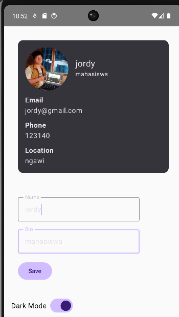

# 📱 MyApplication - Profile App (Jetpack Compose)

## 📖 Deskripsi

Aplikasi Android sederhana yang dibuat menggunakan **Jetpack Compose** dengan konsep **MVVM (Model-View-ViewModel)**.
Aplikasi ini menampilkan profil pengguna, fitur edit profil, dan toggle dark mode.

---

## ✨ Fitur Utama

* 👤 Menampilkan data profil (nama, bio, email, dll)
* ✏️ Edit profil secara real-time
* 🌙 Toggle Dark Mode
* 🔄 State management menggunakan ViewModel & StateFlow
* 🎨 UI modern dengan Jetpack Compose

---

## 🧱 Arsitektur

Menggunakan pola **MVVM**:

* **Model** → `Profile.kt`
* **View** → `ProfileScreen.kt`, `ProfileCard.kt`
* **ViewModel** → `ProfileViewModel.kt`

---

## 📂 Struktur Project

```
com.example.myapplication
│
├── model/
│   └── Profile.kt
│
├── ui/
│   ├── screen/
│   │   └── ProfileScreen.kt
│   │
│   ├── components/
│   │   ├── ProfileCard.kt
│   │   └── DarkModeSwitch.kt
│   │
│   └── viewmodel/
│       ├── ProfileViewModel.kt
│       └── ProfileUiState.kt
```

---

## 🖼️ Screenshot

### 📌 Tampilan Profile




---

## ⚙️ Teknologi yang Digunakan

* Kotlin
* Jetpack Compose
* Material 3
* ViewModel
* StateFlow

---

## 🚀 Cara Menjalankan

1. Clone repository ini
2. Buka di Android Studio
3. Klik **Run ▶️**

---

## 🧩 Contoh State (ProfileUiState)

```kotlin
data class ProfileUiState(
    val name: String = "",
    val bio: String = "",
    val email: String = "",
    val phone: String = "",
    val location: String = "",
    val isDarkMode: Boolean = false
)
```

---

## 👨‍💻 Author

**Jordy Anugrah Akbar**
**123140141**
---
