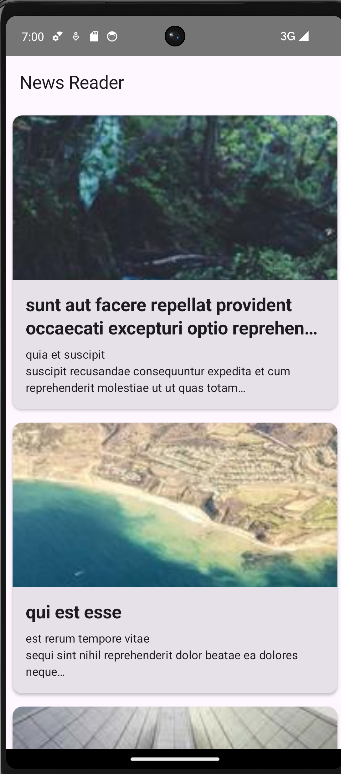

# Aplikasi News Reader

Aplikasi News Reader sederhana yang dibangun menggunakan Compose Multiplatform.

## Fitur
- Daftar artikel yang diambil dari API remote.
- Fitur *Pull-to-refresh* untuk memperbarui daftar berita.
- Tampilan detail untuk setiap artikel.
- Penanganan status *loading* dan *error*.

## API yang Digunakan
Aplikasi ini menggunakan **JSONPlaceholder API** untuk tujuan demonstrasi:
- **Base URL:** `https://jsonplaceholder.typicode.com`
- **Endpoint:** `/posts` (Dipetakan sebagai artikel berita)

## Screenshots

### 1. Status Berhasil (Daftar Artikel)
Layar utama menampilkan daftar artikel yang diambil dari API.

### 2. Status Memuat (Loading)
Indikator progres melingkar ditampilkan saat data sedang diambil.

### 3. Pull-to-Refresh
Pengguna dapat menarik daftar ke bawah untuk memperbarui konten.

### 4. Detail saat di klik

## Tech Stack
- **Compose Multiplatform:**
- **Ktor:** Library jaringan
- **Kotlinx Serialization:**
- **Arsitektur MVVM:** 
- **Coil:** Pemuatan gambar 
