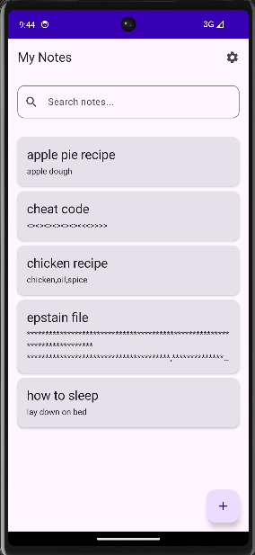
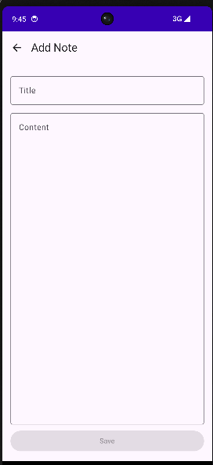
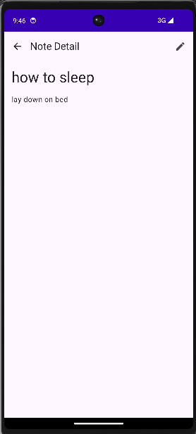
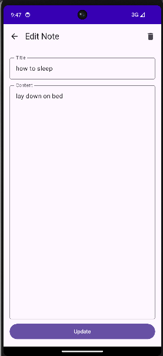
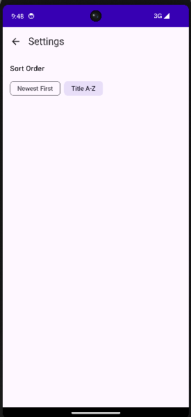

# NoteApp - Aplikasi Pencatat Digital

Aplikasi Android yang memungkinkan pengguna untuk membuat, mengedit, menghapus, dan mencari catatan dengan antarmuka yang intuitif serta mendukung dark mode.


## 🗄️ Database Schema

### Tabel: `noteEntity`

Tabel ini menyimpan semua data catatan pengguna.

| Kolom | Tipe | Deskripsi |
|-------|------|-----------|
| `id` | INTEGER | Primary Key, auto-increment |
| `title` | TEXT | Judul catatan (wajib diisi) |
| `content` | TEXT | Isi catatan (wajib diisi) |
| `createdAt` | INTEGER | Timestamp pembuatan catatan (wajib diisi) |

### Entity Relationship Diagram

```
┌──────────────────────┐
│     noteEntity       │
├──────────────────────┤
│ id (PK)         [INT]│
│ title           [TXT]│
│ content         [TXT]│
│ createdAt       [INT]│
└──────────────────────┘
```

### Query Utama

- **selectAll**: Mengambil semua catatan diurutkan berdasarkan tanggal terbaru
- **insertNote**: Menambah atau memperbarui catatan
- **deleteNote**: Menghapus catatan berdasarkan ID
- **searchNotes**: Mencari catatan berdasarkan judul atau isi
- **getNoteById**: Mengambil catatan spesifik berdasarkan ID


## 📱 Screenshots

Berikut adalah tampilan aplikasi di berbagai screen:

### 1. **Note List Screen (Daftar Catatan)**



### 2. **Add Note Screen (Tambah Catatan)**



### 3. **Note Detail Screen (Detail Catatan)**



### 4. **Edit Note Screen (Edit Catatan)**



### 5. **Settings Screen (Pengaturan)**


