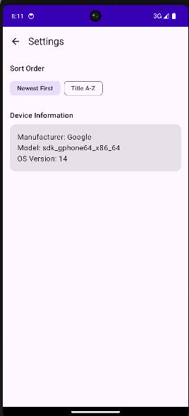
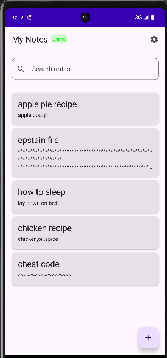

## 🏗️ Architecture Diagram

Aplikasi menggunakan **Clean Architecture** dengan separation of concerns:

```
┌─────────────────────────────────────────────────────────────┐
│                     UI Layer (Screens)                      │
│  ┌──────────────────────────────────────────────────────┐   │
│  │ NoteListScreen │ AddNoteScreen │ EditNoteScreen ...  │   │
│  └──────────────────────────────────────────────────────┘   │
└─────────────────────────────────────────────────────────────┘
                            ↓
┌─────────────────────────────────────────────────────────────┐
│                 Presentation Layer (ViewModel)              │
│  ┌──────────────────────────────────────────────────────┐   │
│  │  NoteViewModel │ NoteViewModelFactory                │   │
│  └──────────────────────────────────────────────────────┘   │
└─────────────────────────────────────────────────────────────┘
                            ↓
┌─────────────────────────────────────────────────────────────┐
│                    Data Layer (Repository)                  │
│  ┌──────────────────────────────────────────────────────┐   │
│  │  DatabaseDriverFactory │ SettingsManager            │   │
│  └──────────────────────────────────────────────────────┘   │
└─────────────────────────────────────────────────────────────┘
                            ↓
┌─────────────────────────────────────────────────────────────┐
│              Platform Layer (Device & Network)              │
│  ┌──────────────────────────────────────────────────────┐   │
│  │ DeviceInfo      │ AndroidDeviceInfo                  │   │
│  │ NetworkMonitor  │ AndroidNetworkMonitor              │   │
│  └──────────────────────────────────────────────────────┘   │
└─────────────────────────────────────────────────────────────┘
```


### Screenshot Device Info:



### Screenshot Network Indicator:



